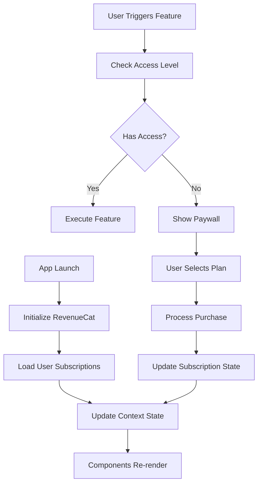

# 📱 Sistema de Suscripciones Aira - Guía Completa

## 🎯 Descripción General

Este documento describe la implementación completa del sistema de suscripciones para la aplicación Aira usando **RevenueCat**. El sistema incluye tres planes: **Gratuito**, **Básico (€5.99/mes)** y **Pro (€7.99/mes)**.

## 📋 Tabla de Contenidos

1. [Arquitectura del Sistema](#-arquitectura-del-sistema)
2. [Configuración Inicial](#-configuración-inicial)
3. [Estructura de Archivos](#-estructura-de-archivos)
4. [Configuración de RevenueCat](#-configuración-de-revenuecat)
5. [Planes y Características](#-planes-y-características)
6. [Uso del Sistema](#-uso-del-sistema)
7. [Configuración para Producción](#-configuración-para-producción)
8. [Testing](#-testing)
9. [Troubleshooting](#-troubleshooting)

## 🏗 Arquitectura del Sistema

### Componentes Principales

```
📁 Sistema de Suscripciones
├── 🔧 Servicios
│   └── subscription.service.ts          # Lógica de negocio RevenueCat
├── 🎯 Contexto
│   └── SubscriptionContext.tsx          # Estado global de suscripciones
├── 🪝 Hooks
│   └── usePaywall.ts                    # Hooks reutilizables
├── 🎨 Componentes
│   ├── SubscriptionCard.tsx             # Tarjeta de plan
│   └── Paywall.tsx                      # Modal de suscripción
├── 📱 Pantallas
│   └── subscription-demo.tsx            # Demo del sistema
├── ⚙️ Configuración
│   ├── Config.ts                        # Configuraciones y API keys
│   └── subscriptions.ts                 # Tipos TypeScript
└── 📄 Documentación
    └── SUBSCRIPTION_SYSTEM_README.md    # Este archivo
```

### Flujo de Datos



## ⚙️ Configuración Inicial

### 1. Instalación de Dependencias

Las dependencias ya están agregadas en `package.json`:

```json
{
  "dependencies": {
    "react-native-purchases": "^8.10.1",
    "react-native-purchases-ui": "^8.10.1"
  }
}
```

Instalar dependencias:

```bash
npm install
# o
yarn install

# Para iOS (solo si usas pods directamente)
cd ios && pod install
```

### 2. Configuración de la App

El archivo `app.json` ya incluye la configuración necesaria:

```json
{
  "expo": {
    "plugins": [
      [
        "react-native-purchases",
        {
          "revenuecat_api_key": "YOUR_REVENUECAT_API_KEY"
        }
      ]
    ],
    "ios": {
      "infoPlist": {
        "NSUserTrackingUsageDescription": "Esta aplicación utiliza datos de seguimiento para proporcionar anuncios personalizados y mejorar la experiencia del usuario."
      }
    },
    "android": {
      "permissions": [
        "com.android.vending.BILLING"
      ]
    }
  }
}
```

## 📁 Estructura de Archivos

### Archivos Principales

| Archivo | Descripción |
|---------|-------------|
| `constants/Config.ts` | Configuración de API keys y planes |
| `types/subscriptions.ts` | Tipos TypeScript |
| `services/api/subscription.service.ts` | Servicio principal de RevenueCat |
| `context/SubscriptionContext.tsx` | Contexto de React |
| `hooks/usePaywall.ts` | Hooks personalizados |
| `components/subscription/SubscriptionCard.tsx` | Componente de tarjeta |
| `components/subscription/Paywall.tsx` | Modal de suscripción |
| `app/subscription-demo.tsx` | Pantalla de demostración |

### Integración en Layout Principal

El contexto se integra en `app/_layout.tsx`:

```tsx
<ClerkProvider>
  <SubscriptionProvider>
    <NotesContainer>
      <CategoriesContainer>
        {/* Resto de la app */}
      </CategoriesContainer>
    </NotesContainer>
  </SubscriptionProvider>
</ClerkProvider>
```

## 🔧 Configuración de RevenueCat

### 1. Dashboard de RevenueCat

1. **Crear cuenta** en [RevenueCat](https://app.revenuecat.com)
2. **Crear proyecto** para Aira
3. **Configurar aplicaciones**:
   - iOS: `com.therrydzk.airanative`
   - Android: `com.therrydzk.airanative`

### 2. Configurar Productos

#### En App Store Connect (iOS):
```
Productos:
- aira_basic_monthly: €5.99/mes
- aira_pro_monthly: €7.99/mes
```

#### En Google Play Console (Android):
```
Productos:
- aira_basic_monthly: €5.99/mes
- aira_pro_monthly: €7.99/mes
```

### 3. Configurar Entitlements en RevenueCat

```
Entitlements:
- basic_features: Acceso a características básicas
- pro_features: Acceso a características pro
```

### 4. API Keys

Actualizar `constants/Config.ts` con las API keys reales:

```typescript
export const REVENUECAT_CONFIG = {
  API_KEYS: {
    IOS: 'appl_YOUR_REAL_IOS_API_KEY_HERE',
    ANDROID: 'goog_YOUR_REAL_ANDROID_API_KEY_HERE',
    AMAZON: 'amzn_YOUR_REAL_AMAZON_API_KEY_HERE'
  },
  // ...resto de la configuración
};
```

## 💰 Planes y Características

### Plan Gratuito (€0/mes)
- ✅ Acceso básico a rutinas
- ✅ Seguimiento básico de progreso
- ✅ Biblioteca limitada de ejercicios

### Plan Básico (€5.99/mes)
- ✅ Todas las características gratuitas
- ✅ Rutinas personalizadas ilimitadas
- ✅ Seguimiento avanzado de métricas
- ✅ Acceso completo a biblioteca de ejercicios
- ✅ Planes de alimentación básicos

### Plan Pro (€7.99/mes)
- ✅ Todas las características del plan básico
- ✅ IA personalizada para recomendaciones
- ✅ Análisis detallado de progreso
- ✅ Planes de alimentación premium
- ✅ Soporte prioritario
- ✅ Acceso anticipado a nuevas funciones

## 🚀 Uso del Sistema

### 1. Verificar Acceso a Características

```tsx
import { useFeatureAccess } from '@/context/SubscriptionContext';

function MyComponent() {
  const hasAIRecommendations = useFeatureAccess('ai_recommendations');
  
  return (
    <View>
      {hasAIRecommendations ? (
        <AIRecommendationsComponent />
      ) : (
        <UpgradePrompt />
      )}
    </View>
  );
}
```

### 2. Mostrar Paywall

```tsx
import { usePaywall } from '@/hooks/usePaywall';

function FeatureComponent() {
  const { showPaywallIfNeeded } = usePaywall();
  
  const handlePremiumFeature = () => {
    const needsUpgrade = showPaywallIfNeeded('pro');
    if (!needsUpgrade) {
      // El usuario tiene acceso, ejecutar característica
      executePremiumFeature();
    }
  };
  
  return (
    <TouchableOpacity onPress={handlePremiumFeature}>
      <Text>Usar Característica Premium</Text>
    </TouchableOpacity>
  );
}
```

### 3. Usar Hook de Característica Premium

```tsx
import { usePremiumFeature } from '@/hooks/usePaywall';

function PremiumButton() {
  const { executeWithAccess } = usePremiumFeature('pro');
  
  const handlePress = () => {
    executeWithAccess(() => {
      // Esta función solo se ejecuta si el usuario tiene acceso
      console.log('Ejecutando característica premium');
    });
  };
  
  return (
    <TouchableOpacity onPress={handlePress}>
      <Text>Característica Pro</Text>
    </TouchableOpacity>
  );
}
```

### 4. Mostrar Paywall Manualmente

```tsx
import { Paywall } from '@/components/subscription/Paywall';

function MyScreen() {
  const [showPaywall, setShowPaywall] = useState(false);
  
  return (
    <View>
      <TouchableOpacity onPress={() => setShowPaywall(true)}>
        <Text>Ver Planes</Text>
      </TouchableOpacity>
      
      <Paywall
        visible={showPaywall}
        onClose={() => setShowPaywall(false)}
        onPurchaseSuccess={(customerInfo) => {
          console.log('Compra exitosa:', customerInfo);
          setShowPaywall(false);
        }}
        onPurchaseError={(error) => {
          console.error('Error en compra:', error);
        }}
        selectedPlan="basic"
      />
    </View>
  );
}
```

## 🔧 Configuración para Producción

### 1. Variables de Entorno

Crear archivo `.env`:

```env
REVENUECAT_IOS_API_KEY=appl_your_ios_key_here
REVENUECAT_ANDROID_API_KEY=goog_your_android_key_here
REVENUECAT_AMAZON_API_KEY=amzn_your_amazon_key_here
```

### 2. Configuración de EAS Build

Actualizar `eas.json`:

```json
{
  "build": {
    "production": {
      "env": {
        "REVENUECAT_IOS_API_KEY": "appl_your_production_ios_key",
        "REVENUECAT_ANDROID_API_KEY": "goog_your_production_android_key"
      }
    },
    "preview": {
      "env": {
        "REVENUECAT_IOS_API_KEY": "appl_your_sandbox_ios_key",
        "REVENUECAT_ANDROID_API_KEY": "goog_your_sandbox_android_key"
      }
    }
  }
}
```

### 3. Configuración de Store

#### App Store (iOS)
1. Configurar productos en App Store Connect
2. Crear acuerdos de pago
3. Configurar información fiscal
4. Probar con usuarios sandbox

#### Google Play (Android)
1. Configurar productos en Google Play Console
2. Crear cuenta de comerciante
3. Configurar información fiscal
4. Probar con cuentas de prueba

## 🧪 Testing

### 1. Testing en Desarrollo

```tsx
// Usar la pantalla de demo
import SubscriptionDemo from '@/app/subscription-demo';

// Navegar a /subscription-demo para probar
```

### 2. Testing con Cuentas Sandbox

#### iOS Sandbox
1. Crear usuarios sandbox en App Store Connect
2. Cerrar sesión en App Store en dispositivo
3. Usar credenciales sandbox al hacer compras

#### Android Testing
1. Agregar cuentas de prueba en Google Play Console
2. Usar tracks internos para testing
3. Probar con usuarios beta

### 3. Testing de Restauración

```tsx
const { restorePurchases } = useSubscription();

const testRestore = async () => {
  const result = await restorePurchases();
  console.log('Resultado de restauración:', result);
};
```

## 🛠 Troubleshooting

### Problemas Comunes

#### 1. Error: "API key not configured"
**Solución**: Verificar que las API keys estén correctamente configuradas en `Config.ts`

#### 2. Error: "Product not available"
**Solución**: 
- Verificar que los productos estén configurados en las stores
- Verificar que los IDs de productos coincidan
- Verificar que los productos estén aprobados

#### 3. Error: "Purchase cancelled"
**Solución**: Es normal, el usuario canceló la compra

#### 4. Error de inicialización
**Solución**: 
- Verificar que RevenueCat esté inicializado antes de usar
- Verificar conexión a internet
- Verificar que la app tenga permisos de billing

### Logs de Debug

Para habilitar logs detallados:

```typescript
// En development
if (__DEV__) {
  Purchases.setLogLevel(LOG_LEVEL.VERBOSE);
}
```

### Verificar Estado

```tsx
const { subscriptionState } = useSubscription();

console.log('Estado actual:', {
  isLoading: subscriptionState.isLoading,
  currentPlan: subscriptionState.currentPlan,
  hasActiveSubscription: subscriptionState.hasActiveSubscription,
  error: subscriptionState.error
});
```

## 📚 Referencias

- [Documentación RevenueCat](https://docs.revenuecat.com/)
- [React Native Purchases](https://github.com/RevenueCat/react-native-purchases)
- [App Store Connect](https://appstoreconnect.apple.com/)
- [Google Play Console](https://play.google.com/console/)

## 🤝 Contribución

Para contribuir al sistema de suscripciones:

1. Seguir las convenciones de código establecidas
2. Agregar tests para nuevas funcionalidades
3. Actualizar documentación
4. Probar en ambas plataformas (iOS/Android)

## 📄 Licencia

Este sistema es parte de la aplicación Aira y está sujeto a las mismas condiciones de licencia.

---

**¡El sistema de suscripciones está listo para usar!** 🎉

Para cualquier duda o problema, consultar este documento o contactar al equipo de desarrollo. 